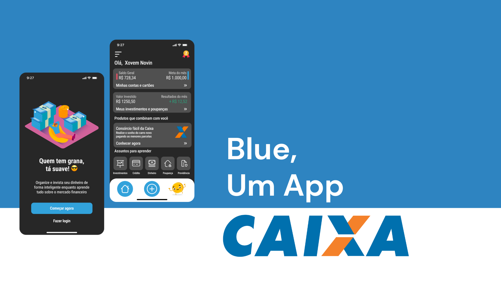

# Hackathon CPBR15 - CAIXA & VISA

## Soluções do Blue

Criamos o Blue, um aplicativo que será totalmente integrado ao atual app da Caixa Econômica, que atenderá o anseio por agilidade e dinamismo dos jovens

- Acesso facilitado a produtos Caixa, como contas, cartões e linhas de crédito
- Integração com meios de pagamento, como o PIX e NFC
- Definição de metas de orçamento e gestão de gastos completa
- Mini-cursos práticos para aprender sobre finanças e desenvolver bons hábitos
- Gameficação com personagens colecionáveis para motivar o jovem a poupar e aprender a investir

## Ajudando o jovem a poupar com gameficação

## Sobre Nós

A equipe da [FWC Tecnologia](https://fwctecnologia.com/) é especialista em desenvolvimento de aplicativos utilizando o framework Flutter e NodeJS, um dos mais populares do mercado.
